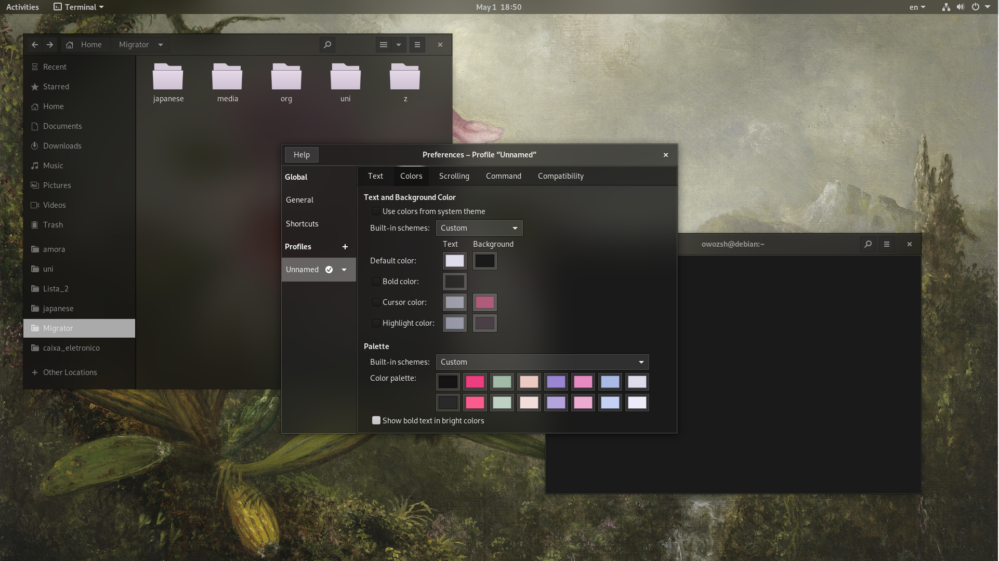

# Myopia Theme for GTK+

## Warning

This theme was only tested on Gnome 3.36 and 3.38.

For blur support, install the 'blur-me' gnome extension.

## Installation

Make sure you have the "User Themes" extension turned on.

To install, copy the `Myopia` folder and paste it in `~/.local/share/themes` or `~/.themes`, and select the theme in Gnome Tweaks.

### Variations of this theme

There are some variations of this theme on the 'Variations' folder ;)

## Tweaking

Make sure to tweak themes inside the original Myopia-Theme repository.

You can customize colors, transparency and other stuff in the file `Settings.scss` (Inside the 'Tweaking' folder). For advanced tweaks, use the Advanced folder.

Then, inside the 'Tweaking' folder, open the terminal and type `./parse.sh`, this will recreate the 'Myopia' folder with your new settings.

After all of these steps, follow the Installation guide to get your new Myopia customized theme ;)

## Donate!

Making this theme real and good takes a lot of time of designing and coding. So if you like the project, consider donating to keep me motivated maintaining it :)

https://www.buymeacoffee.com/owozsh

