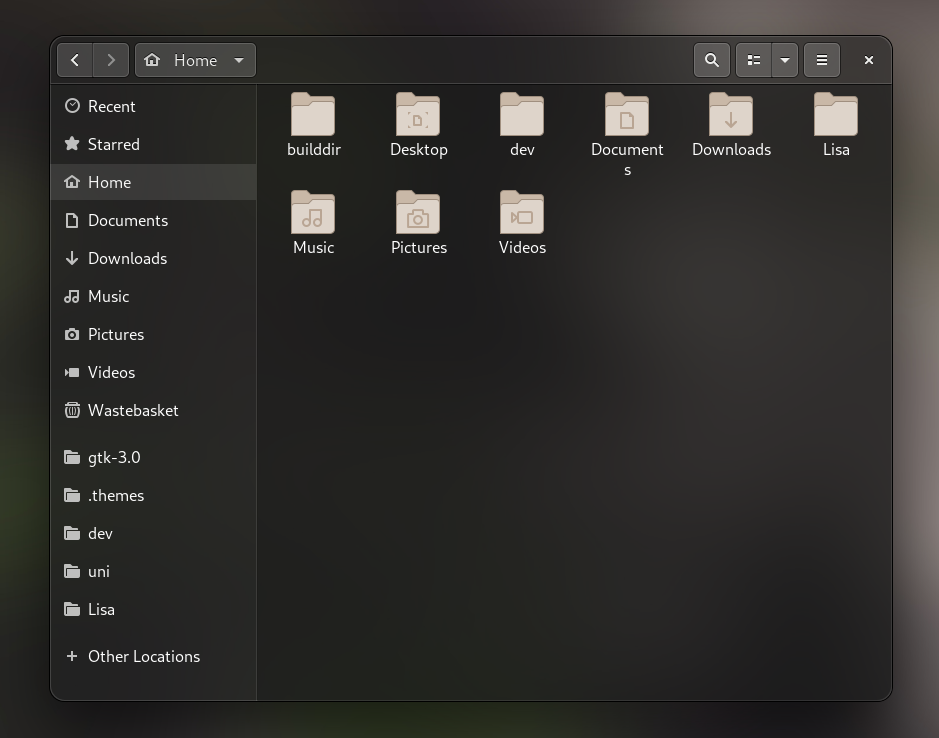

# Myopia Theme for GTK+

## Warning

This is a work in progress.

The blur doesn't work, it uses transparency only.

This theme is based on Adwaita, for now, it only works well overriding Adwaita's css.

## Instalation

For now, I'd only recomend using the Overriding Theme.

To use you need to have the Adwaita Dark theme installed and selected, this theme will override some code of it.

To install it, copy the 'gtk.css' file on the 'Overriding Theme' folder and paste it on '.config/gtk-3.0/' replacing the old gtk.css file.

## Notes

The formal version of the theme is still being worked on, so you cannot use it on the '.theme' directory yet.

### Donate! 

Making this theme real and good takes a lot of time of designing and coding. So if you like the project, consider donating to keep me motivated maintaining it :)

https://www.paypal.com/cgi-bin/webscr?cmd=_s-xclick&hosted_button_id=6B3MUW2KH4LXN&source=url
