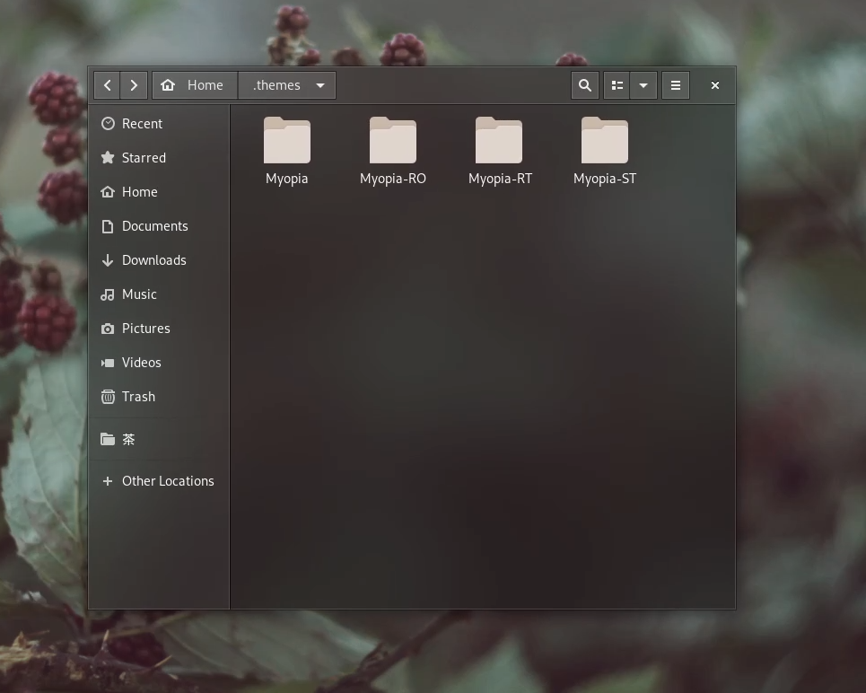
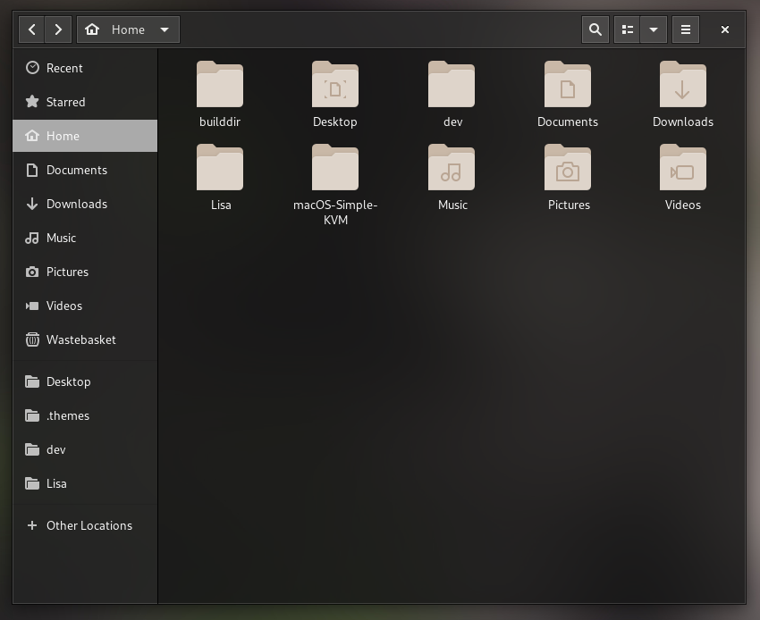
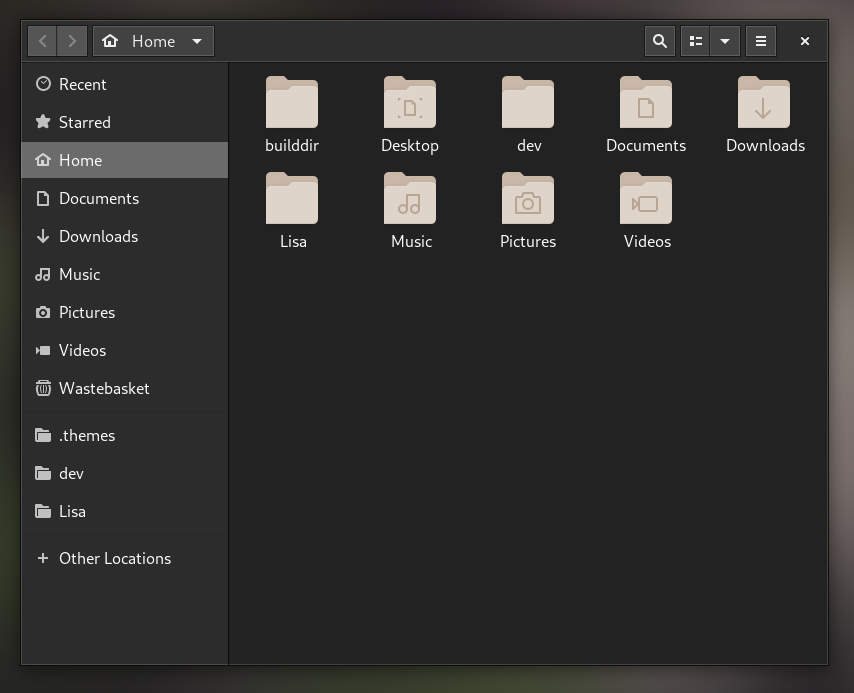

# Myopia Theme for GTK+

## Warning

This is a work in progress. It has some bugs still.

The blur doesn't work, it uses transparency only.

There will be a light theme soon.

## Installation

Make sure you have the "User Themes" extension turned on.

To install, ,copy one of the themes on the 'Themes' folder and paste it on '~/.themes', and select the theme in Gnome Tweaks.

## Tweaking

Make sure to tweak themes inside the original Myopia-GTK repository.

There are some basic customization on every theme folder, called "Myopia-Settings.scss". You can customize colors, transparency and other stuff in this file.

Then, open the selected theme folder on terminal and type "./parse-sass.sh", this will generate your new css file on gtk-3.0.

After all of these steps, follow the Installation guide to get your new Myopia customized theme ;)

### Donate! 

Making this theme real and good takes a lot of time of designing and coding. So if you like the project, consider donating to keep me motivated maintaining it :)

https://www.paypal.com/cgi-bin/webscr?cmd=_s-xclick&hosted_button_id=6B3MUW2KH4LXN&source=url
